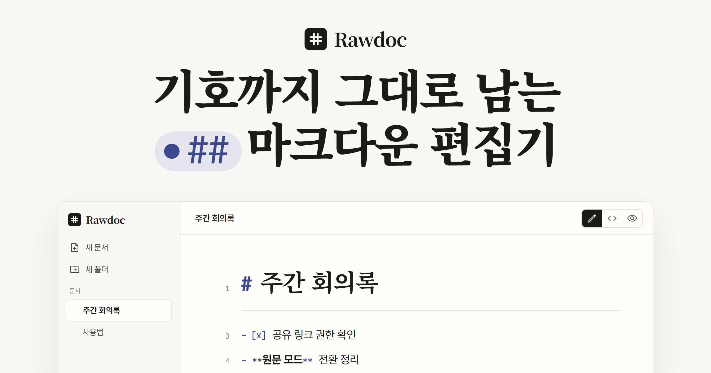

<p align="center">
  
</p>

<h1 align="center">Rawdoc</h1>

<p align="center">
  기호까지 그대로 남는 마크다운 편집기입니다<br>
  <a href="https://rawdoc.app"><strong>rawdoc.app</strong></a>
</p>

## 소개

Rawdoc 은 입력한 마크다운 기호를 지우거나 바꾸지 않는 편집기입니다. `##` 를 쳐도 기호가 화면에서 사라지지 않고, `.md` 로 내보낸 파일은 사용자가 입력한 원문과 바이트 단위로 같습니다

편집 화면은 Obsidian 의 라이브 프리뷰 방식을 따릅니다. 커서가 있는 줄은 원문으로, 나머지 줄은 서식이 적용된 모습으로 보입니다

소규모 개발팀이 문서를 함께 쓰는 용도를 목표로 하며, UI 는 한국어이고 한글 입력(IME)을 기준으로 다듬고 있습니다

## 주요 기능

### 편집

- **세 가지 보기 모드** — 편집(라이브 프리뷰) · 원문 · 보기(읽기 전용 HTML)
- **GFM 마크다운** — 제목, 목록, 체크박스, 인용, 표, 코드블록, 콜아웃(`> [!note]`), YAML 프론트매터
- **Mermaid 다이어그램** — ` ```mermaid ` 코드블록을 다이어그램으로 표시합니다
- **표 편집** — 표 모양 그대로 칸을 편집하고 행·열을 추가·삭제합니다
- **위키링크** — `[[문서 제목]]` 으로 다른 문서를 연결하고, `[[` 입력 시 자동완성합니다
- **입력 도움** — 단축키(Ctrl+B · I · K), 자동 짝 기호, 우클릭 서식 메뉴, 찾기·바꾸기(Ctrl+H)
- **이미지** — 붙여넣기·끌어놓기로 넣고, 정렬과 크기를 조절합니다
- **목차** — `#`~`###` 제목으로 오른쪽 목차를 자동으로 만듭니다

### 문서 관리

- 폴더(2단계), 상단 고정, 여러 항목 선택·이동
- `.md` 가져오기·내보내기. 이미지가 있으면 `.md` 와 `attachments/` 를 zip 으로 내보냅니다
- 화이트 · 세피아 · 다크 테마, 서체·글자 크기·들여쓰기 설정

### 계정과 공유

- **로그인 없이 사용** — 로그인하지 않으면 문서는 브라우저(IndexedDB)에만 저장됩니다
- **로그인하면 서버 저장** — 다른 기기에서도 같은 문서가 열리고, 오프라인에서 고친 내용은 온라인이 되면 올라갑니다
- **읽기 전용 공유 링크** — 문서·폴더 단위로 발급하며, 받는 사람은 로그인하지 않고 봅니다
- **초대와 권한** — 이메일로 `보기`/`편집` 권한을 줍니다. 편집은 한 번에 한 명만 할 수 있습니다
- **API 토큰** — 개인 토큰으로 `/v1` API 를 호출해 문서를 자동으로 올릴 수 있습니다

### 앱 설치(PWA)

- 데스크톱 Chrome 에서 앱으로 설치할 수 있고, 첫 방문 이후에는 네트워크 없이도 편집·저장이 됩니다
- 설치하면 OS 의 `.md` 파일 열기 대상으로 등록됩니다 (Chrome·Edge)

> 기준 브라우저는 데스크톱 Chrome 입니다. 다른 브라우저와 모바일 화면은 아직 판정 대상이 아닙니다

## 앞으로 할 것

- 실시간 동시 편집과 접속자 커서
- 텍스트 내용에 붙는 댓글
- GitHub 저장소로 문서 푸시
- 안드로이드 앱

## 기술 스택

| 영역 | 사용 기술 |
| --- | --- |
| 프론트엔드 | React 19, Vite 7, TypeScript |
| 에디터 | CodeMirror 6, `@codemirror/lang-markdown` |
| PWA | `vite-plugin-pwa` (Workbox) |
| 서버 | Cloudflare Workers, D1, R2 |
| 인증 | Cloudflare Access |
| 테스트 | Vitest, Playwright |

## 개발 명령어

| 명령어 | 내용 |
| --- | --- |
| `npm install` | 의존성 설치 |
| `npm run dev` | 웹앱 개발 서버 |
| `npm run dev:worker` | 빌드 후 Worker 로컬 실행 (로컬 D1·R2) |
| `npm run build` | 웹앱 빌드 |
| `npm run lint` | ESLint |
| `npm run typecheck` | 앱 타입 검사 |
| `npm run typecheck:worker` | Worker 타입 검사 |
| `npm test` | 단위 테스트 (Vitest) |
| `npm run test:e2e` | E2E 테스트 (Playwright, 설치된 Chrome 사용) |
| `npm run verify` | 린트·단위 테스트·빌드 한 번에 |
