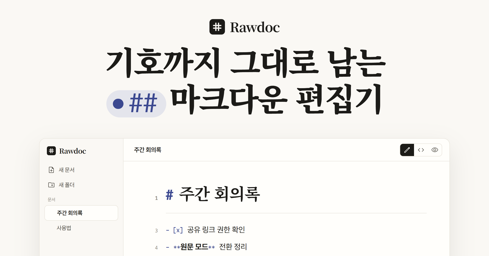

<p align="center">
  
</p>

<h1 align="center">Rawdoc</h1>

<p align="center">
  기호까지 그대로 남는 마크다운 편집기입니다<br>
  <a href="https://rawdoc.app"><strong>rawdoc.app</strong></a>
</p>

<p align="center">
  <a href="https://rawdoc.app"></a>
  <a href="https://github.com/R00neyj/rawdoc/commits/deploy"></a>
  <a href="https://github.com/R00neyj/rawdoc/actions/workflows/ci.yml"></a>
</p>

## 소개

Rawdoc 은 입력한 마크다운 기호를 지우거나 바꾸지 않는 편집기입니다. `##` 를 쳐도 기호가 화면에서 사라지지 않고, `.md` 로 내보낸 파일은 사용자가 입력한 원문과 바이트 단위로 같습니다

편집 화면은 Obsidian 의 라이브 프리뷰 방식을 따릅니다. 커서가 있는 줄은 원문으로, 나머지 줄은 서식이 적용된 모습으로 보입니다

소규모 개발팀이 문서를 함께 쓰는 용도를 목표로 하며, UI 는 한국어이고 한글 입력(IME)을 기준으로 다듬고 있습니다

## 주요 기능

### 편집

- **세 가지 보기 모드** — 편집(라이브 프리뷰) · 원문 · 보기(읽기 전용 HTML)
- **GFM 마크다운** — 제목, 목록, 체크박스, 인용, 표, 코드블록, 콜아웃(`> [!note]`), YAML 프론트매터
- **Mermaid 다이어그램** — ` ```mermaid ` 코드블록을 다이어그램으로 표시합니다
- **표 편집** — 표 모양 그대로 칸을 편집하고 행·열을 추가·삭제합니다
- **위키링크** — `[[문서 제목]]` 으로 다른 문서를 연결하고, `[[` 입력 시 자동완성합니다
- **입력 도움** — 단축키(Ctrl+B · I · K), 자동 짝 기호, 우클릭 서식 메뉴, 찾기·바꾸기(Ctrl+H)
- **이미지** — 붙여넣기·끌어놓기로 넣고, 정렬과 크기를 조절합니다
- **목차** — `#`~`###` 제목으로 오른쪽 목차를 자동으로 만듭니다

### 문서 관리

- 폴더(2단계), 상단 고정, 여러 항목 선택·이동
- `.md` 가져오기·내보내기. 이미지가 있으면 `.md` 와 `attachments/` 를 zip 으로 내보냅니다
- 화이트 · 세피아 · 다크 테마, 서체·글자 크기·들여쓰기 설정

### 계정과 공유

- **로그인 없이 사용** — 로그인하지 않으면 문서는 브라우저(IndexedDB)에만 저장됩니다
- **로그인하면 서버 저장** — 다른 기기에서도 같은 문서가 열리고, 오프라인에서 고친 내용은 온라인이 되면 올라갑니다
- **읽기 전용 공유 링크** — 문서·폴더 단위로 발급하며, 받는 사람은 로그인하지 않고 봅니다
- **초대와 권한** — 이메일로 `보기`/`편집` 권한을 줍니다
- **API 토큰** — 개인 토큰으로 `/v1` API 를 호출해 문서를 자동으로 올릴 수 있습니다

### 실시간 공동 편집

- **동시 편집** — `편집` 권한이 있는 사람과 문서 주인이 같은 문서를 열면 입력한 글이 서로의 화면에 바로 들어갑니다
- **접속자와 커서** — 같은 문서를 연 사람이 상단바에 보이고, 본문에는 사람마다 다른 색의 커서와 선택 범위가 보입니다
- **내 편집만 되돌리기** — `Ctrl+Z` 는 내가 고친 것만 되돌립니다
- **연결이 끊겨도 편집** — 끊긴 동안 고친 내용은 브라우저에 저장되었다가 다시 연결되면 합쳐집니다
- **한글 입력 중에는 반영을 미룸** — 다른 사람의 변경이 글자 조합(IME)을 끊지 않도록, 조합이 끝난 뒤 적용합니다
- 서버에 실시간 연결이 되지 않으면 한 번에 한 명만 편집하는 방식으로 바뀝니다

### 댓글

- **본문 일부에 댓글** — 글을 골라 댓글을 달면 그 글자에 붙어, 앞뒤를 고쳐도 따라 움직입니다. 문서 원문과 `.md` 내보내기에는 들어가지 않습니다
- **답글·해결·삭제** — 끝난 댓글은 `해결` 로 접습니다. 댓글을 단 글이 모두 지워지면 레일 맨 아래에 따로 모입니다
- **멘션과 알림** — `@` 로 문서에 들어올 수 있는 사람을 불러 알림함에 알립니다. 설치한 앱·브라우저에서는 푸시 알림도 켤 수 있습니다
- **권한별 동작** — `보기` 권한으로 받은 문서에도 댓글을 달 수 있습니다. 로그인하지 않고 쓰는 문서의 댓글은 브라우저에 저장되고, 로그인할 때 문서와 함께 계정으로 옮겨집니다
- 금고(종단간 암호화) 문서에는 댓글 기능이 없습니다

### 명령줄 도구(CLI)

터미널에서 문서를 읽고 쓰는 `rawdoc` 입니다. Node 22 이상이 필요합니다

```
npm i -g rawdoc
rawdoc login
rawdoc ls
```

- **문서 읽기·쓰기** — `ls`·`find`·`get`·`new`·`put` 으로 목록 보기, 검색, 원문 받기, 새 문서 만들기, 고치기를 합니다
- **정리와 공유** — 폴더(`folders`·`mkdir`·`rmdir`), 옮기기(`mv`), 지우기(`rm`), 이미지 올리기(`upload`), 읽기 전용 링크(`link`)
- **원문 그대로** — `get` 은 글자를 바꾸지 않고 내보냅니다. `put` 은 `--base-version` 으로 읽은 판 번호를 넘겨 다른 곳의 변경을 덮어쓰지 않습니다
- **스크립트·AI 도구용** — 모든 명령이 `--json` 을 받고, 토큰은 `RAWDOC_TOKEN` 환경 변수로도 넘길 수 있습니다. `rawdoc syntax` 는 이 앱의 마크다운 문법을 출력합니다

자세한 사용법은 [터미널에서 문서 읽고 쓰기](https://rawdoc.app/guides/cli) 에 있습니다

### 앱 설치(PWA)

- 데스크톱 Chrome 에서 앱으로 설치할 수 있고, 첫 방문 이후에는 네트워크 없이도 편집·저장이 됩니다
- 설치하면 OS 의 `.md` 파일 열기 대상으로 등록됩니다 (Chrome·Edge)

> 기준 브라우저는 데스크톱 Chrome 입니다. 다른 브라우저와 모바일 화면은 아직 판정 대상이 아닙니다

## 앞으로 할 것

- GitHub 저장소로 문서 푸시
- 안드로이드 앱

## 기술 스택

| 영역 | 사용 기술 |
| --- | --- |
| 프론트엔드 | React 19, Vite 7, TypeScript |
| 에디터 | CodeMirror 6, `@codemirror/lang-markdown` |
| PWA | `vite-plugin-pwa` (Workbox) |
| 실시간 편집 | Yjs, `y-codemirror.next`, Cloudflare Durable Objects (`y-partyserver`) |
| 서버 | Cloudflare Workers, D1, R2 |
| 인증 | `better-auth` (Google·GitHub 로그인), CLI 용 API 토큰 |
| CLI | Node 22+, 런타임 의존성 없음, npm `rawdoc` |
| 테스트 | Vitest, Playwright |

## 개발 명령어

| 명령어 | 내용 |
| --- | --- |
| `npm install` | 의존성 설치 |
| `npm run dev` | 웹앱 개발 서버 |
| `npm run dev:worker` | 빌드 후 Worker 로컬 실행 (로컬 D1·R2) |
| `npm run build` | 웹앱 빌드 |
| `npm run lint` | ESLint |
| `npm run typecheck` | 앱 타입 검사 |
| `npm run typecheck:worker` | Worker 타입 검사 |
| `npm test` | 단위 테스트 (Vitest) |
| `npm run test:e2e` | E2E 테스트 (Playwright, 설치된 Chrome 사용) |
| `npm run verify` | 린트·단위 테스트·빌드 한 번에 |
