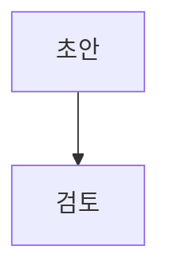

# F-2118 명령줄 도구 syntax 명령 — 이 앱 마크다운 문법 출력

작성일: 2026-10-03
상태: 승인됨(2026-10-03). 결정할 갈림길이 없어 '명세 작성 후 결정이 없으면 바로 구현' 상시 지시(2026-09-21)로 승인하고, 별도 검토는 거치지 않았다. 사용자 요청(2026-10-03) "cli에 문법 안내가 없나? 콜아웃을 몰라서 오래 헤매던데". 선행 개요 없음 — 구현 단위 하나(`cli/` + 도움말 문법 데이터 분리). 8장 열린 질문은 모두 기본값이 건전해 기본값대로 간다
구현 담당: `feature-implementer`

## 정해진 것 (사용자 결정, 바꾸지 않는다)

1. `rawdoc` CLI 에 문법을 터미널에 출력하는 명령을 더한다. 이름 `syntax`
2. `rawdoc --help` 끝에 문법 안내 한 줄을 더한다(이 명세). `content/guides/cli.md` 의 URL 문법 안내 단락은 main 이 명세 없이 따로 넣었다(이 명세 소유 아님)
3. 제로 런타임 의존성, Node 22+, 모든 명령이 `--json` 을 받는다, 종료 코드 표(F-2021 4.5)는 그대로

## 근거 (직접 읽거나 돌려 본 것, 2026-10-03 HEAD `04755d8`)

- **CLI 는 이미 `src/lib` 를 import 해 번들한다** — `cli/src/main.ts` 가 `../../src/lib/siteMeta`·`decodeMarkdown`·`cliLoginUrl`·`cliSeal`, `../../brand.config` 를 import, `cli/vite.config.ts` 가 `ssr.noExternal: true`. 복사 단계는 필요 없다
- **그러나 `src/app/helpDoc.ts` 는 가져올 수 없다** — F-2021 3.5 "`src/lib` 에서 가져오는 파일은 3.4 목록뿐이다. `src/app`·`src/editor`·`src/storage` 는 가져오지 않는다"
- **번들 크기 실측**(scratchpad 에서 같은 Vite SSR 설정으로 빌드, `cli/dist` 는 건드리지 않음): 지금 `main.ts` 만 **53,565 B** / `helpDoc.ts` 통째로 더하면 **77,339 B(+23,774, +44%)** / 문법 묶음(`GROUPS`·렌더 함수)만 더하면 **57,416 B(+3,851)**. `helpDoc.ts` 의 대부분은 앱 사용법 절(`APP_SECTIONS`)이다
- `helpDoc.ts` 가 `brand` 를 쓰는 곳은 `명령줄 도구` 절의 `CLI` 상수 하나뿐 — `GROUPS` 는 제품명을 안 쓴다. 분리한 문법 모듈에 `brand` import 가 필요 없다
- **mermaid 는 도움말에 넣을 수 없다** — `site/build.ts` 가 `helpContent()` 에도 `checkContentFile` 을 돌리고, `site/guard.ts` `MERMAID_FENCE_RE`(백틱 펜스 + `mermaid`)가 빌드를 실패시킨다. 그래서 지금 `GROUPS` 에 다이어그램이 없다
- 콜아웃 머리 줄은 `src/lib/callout.ts` `HEADER_RE` — `]` 뒤에 공백이 있어야 제목이 붙는다(`[!tip]제목` 은 콜아웃 아님). `KIND_ALIASES` 키에 `note`·`tip`·`warning`·`danger` 가 있고, 없는 이름은 `note`
- `upload` 가 돌려주는 `markdown` 은 `worker/v1.ts` `handleCreateAttachmentV1` 이 `buildImageBlock`(`src/lib/imageBlock.ts`)으로 만든 `<div align="center">` 3줄 — 도움말 `이미지` 항목 원문과 같은 모양
- 위키링크 별칭 `[[회의록|지난주 회의에서 정한 것]]`·폴더 `[[교안/1주차]]`·제목 `[[회의록#결정]]` — `content/guides/wiki-links.md`
- 태그는 `specs/product.md` 범위 밖(“태그, 휴지통, 버전 히스토리”) — 인라인 `#태그` 문법은 없다. 넣지 않는다
- 도움말 `## 명령줄 도구` 본문 **586자·4문단**(F-2039 U1 방식으로 셈). `HELP_DOC_CONTENT` 는 10,412 코드 포인트, sha256 `146fcc48…004ac8`
- `main()` 은 명령 분기 **전에** `resolveServerOrigin` 과 실제 파일 시스템 `readCredentials` 를 부른다 — `syntax` 는 그 앞에서 갈라야 한다
- `args.ts` 의 `logout`·`whoami`·`folders` 분기가 `GLOBAL_OPTIONS` 만 받고 위치 인자를 거절한다 — `syntax` 도 같은 분기에 넣는다

## 1. 파일 소유

| 파일 | 변경 |
| --- | --- |
| `src/lib/markdownSyntax.ts` | **신규.** 문법 데이터 `SYNTAX_GROUPS` 와 `fenceSource` (2.1). 순수, import 없음 |
| `src/app/helpDoc.ts` | `GROUPS`·`HelpItem`·`HelpGroup`·`fence` 를 지우고 `markdownSyntax` 에서 가져온다. `cliOnly` 그룹은 거른다 (2.2) |
| `cli/src/syntax.ts` | **신규.** 터미널 출력과 `--json` 값 만들기 (3장) |
| `cli/src/args.ts` | `syntax` 명령 (4.1) |
| `cli/src/main.ts` | 설명·`--help` 끝 줄·분기 (4.2) |
| `cli/tsconfig.json` | `include` 에 `../src/lib/markdownSyntax.ts` |
| `cli/package.json` | `version` `0.3.0` → `0.3.1` (6장) |
| `cli/README.md` | 명령 표에 `syntax` 한 행 |
| `tests/src/lib/markdownSyntax.test.ts` | **신규.** 데이터 유효성·도움말 일치 (5장 A10~A12) |
| `tests/cli/src/syntax.test.ts` | **신규.** 출력 (A2~A6) |
| `tests/cli/src/main.test.ts` | 진입점 (A1·A7~A9) |
| `tests/cli/src/args.test.ts` | 인자 해석 (A7) |
| `tests/cli/src/brandGuard.test.ts` | `SOURCE_FILES` 에 `syntax.ts` (A13) |

e2e 없음 — 브라우저가 관여하지 않는다. `App.tsx` 변경 없음

## 2. 데이터 분리

### 2.1 `src/lib/markdownSyntax.ts` (계약)

```ts
export type SyntaxItem = {
  name: string
  source: string
  caption?: string      // 도움말·CLI 둘 다 쓴다
  showResult?: boolean  // 도움말만 읽는다 (지금 의미 그대로)
}
export type SyntaxGroup = {
  group: string
  items: SyntaxItem[]
  guide?: { title: string; slug: string } // 도움말만 읽는다
  cliOnly?: true        // 도움말에서 뺀다 — 사이트 가드에 걸리는 문법
  cliNote?: string      // CLI 출력에만, 그룹 끝 한 문단
}
export const SYNTAX_GROUPS: SyntaxGroup[]
export function fenceSource(source: string): string // 지금 helpDoc.ts fence 그대로
```

- 지금 `GROUPS` 13개를 **순서·글자 그대로** 옮긴다. 도움말 결과가 바이트 하나 바뀌지 않아야 한다(A10)
- 더하는 것은 아래뿐. `cliNote` 는 도움말에 나가지 않으므로 R4(도움말 절과 글 사이 문장 옮김 금지) 판정 밖이다

| 그룹 | 더하는 것 |
| --- | --- |
| `콜아웃` | `cliNote`: `` `]` 뒤에 한 칸 띄우고 제목을 씁니다. 종류는 `note`·`tip`·`warning`·`danger` 등이고, 모르는 이름은 `note` 모양으로 보입니다. `` |
| `위키링크` | `cliNote`: `` `[[폴더/문서 제목]]`·`[[문서 제목#제목]]`·`[[문서 제목\|보일 글자]]`도 됩니다. `` |
| `수식` | `cliNote`: `` `$` 바로 안쪽에 공백을 두지 않습니다. `$$` 수식은 앞뒤를 빈 줄로 뗍니다. `` |
| `이미지` | `cliNote`: `` `upload` 명령이 출력한 세 줄을 그대로 붙입니다. `` |
| **새 그룹** `다이어그램`(`수식` 바로 뒤) | `cliOnly: true`, 항목 하나 `name: '다이어그램'` — `source`·`caption` 은 아래 |

(위 표의 `\|` 는 표 칸 이스케이프다. 실제 문자열은 `|`)

다이어그램 항목 `source`(4줄, LF) 와 `caption`:

`````

`````

``코드블록 언어 자리에 `mermaid`를 적으면 다이어그램으로 그립니다. 문법은 Mermaid를 따릅니다.``

### 2.2 `helpDoc.ts`

- `renderItem`·`renderGroup`·앱 사용법 절·`HELP_DOC_CONTENT` 의 조립 방식은 그대로. 문법 그룹은 `SYNTAX_GROUPS` 에서 `cliOnly` 를 뺀 것을 쓰고, 펜스는 `fenceSource`
- `cliNote` 는 읽지 않는다
- 왜 분리인가: 통째로 번들하면 F-2021 3.5 위반이고 번들이 44% 커진다. 분리하면 +약 3.9KB 이고 앱 도움말과 CLI 가 같은 배열을 읽어 어긋날 수 없다

## 3. 출력 — `cli/src/syntax.ts`

### 3.1 계약

```ts
export const APP_SYNTAX_GROUPS: string[] // ['콜아웃', '위키링크', '수식', '다이어그램', '이미지', '프론트매터']
export function syntaxHelpUrl(): string   // new URL('help', SITE_URL).href
export function renderSyntaxMarkdown(version: string): string
export type SyntaxJson = {
  version: string
  helpUrl: string
  groups: Array<{
    group: string
    appOnly: boolean
    items: Array<{ name: string; source: string; caption?: string }>
    note?: string // cliNote
  }>
}
export function syntaxJson(version: string): SyntaxJson
```

### 3.2 사람용 출력 (표준 출력, 마크다운 그대로)

- 첫 줄 `# {brand.name} 마크다운 문법`, 빈 줄, `문서에 쓰는 마크다운입니다. 일반 마크다운에 없는 문법을 먼저 둡니다.`
- `## 이 앱의 문법` 아래 `APP_SYNTAX_GROUPS` 순서로, 이어서 `## 일반 마크다운` 아래 나머지 그룹을 `SYNTAX_GROUPS` 순서로
- 그룹마다 `### {group}`. 항목이 둘 이상인 그룹은 항목마다 이름 한 줄을 펜스 앞에 둔다. 항목은 `fenceSource(source)`, 있으면 `caption`. 그룹 끝에 있으면 `cliNote`. 덩어리 사이는 빈 줄 하나
- **결과 예시를 넣지 않는다**(`showResult` 무시) — 터미널에서 그려지지 않고, 같은 글자가 두 번 나와 토큰만 쓴다. `사용법 글:` 줄도 넣지 않는다(상대 주소라 터미널에서 못 연다)
- 마지막 문단: `{brand.cliName} {version} 기준입니다. 최신 문법은 {syntaxHelpUrl()} 에서 봅니다.` 그리고 끝 `\n` 하나. 줄바꿈은 LF
- 크기: 초안을 scratchpad 에서 렌더해 **1,443 코드 포인트 / 2,440 B / 169줄**. 상한 2,000 코드 포인트(A5)
- 왜 이 앱 문법이 먼저인가: 출력을 앞부분만 읽는 도구도 콜아웃·위키링크는 보게. 일반 마크다운은 AI 가 이미 안다
- `APP_SYNTAX_GROUPS` 를 데이터 플래그가 아니라 CLI 쪽 순서 배열로 둔 이유: 도움말 순서(제목부터)를 바꾸지 않고 CLI 만 콜아웃을 맨 앞에 둔다

### 3.3 판 고정

- 출력은 설치된 CLI 판에 박혀 있다. 낡음은 위 마지막 문단으로만 알린다 — 판 번호와 최신 문법 주소(`SITE_URL` 기준, `--server`·`RAWDOC_SERVER` 와 무관한 공개 사이트 `/help`)
- npm 최신 판을 조회하지 않는다 — `syntax` 는 토큰·네트워크 없이 돌아야 한다(4.2)
- 앱이 새 문법을 더하면 그 명세가 `SYNTAX_GROUPS` 를 고치고 CLI 를 재발행한다(7장 `product.md` 메모)

### 3.4 `--json`

`JSON.stringify(syntaxJson(version))` + `\n` 한 줄. `groups` 순서는 3.2 와 같다. `appOnly` 는 `APP_SYNTAX_GROUPS` 에 든 그룹이면 `true`. `showResult`·`guide`·`cliOnly` 는 싣지 않는다

## 4. 명령 배선

### 4.1 `args.ts`

- `RunCommand` 에 `{ name: 'syntax'; global: GlobalOptions }`, `COMMAND_NAMES` **맨 끝**(`link` 뒤)
- `logout`·`whoami`·`folders` 와 같은 분기 — 위치 인자·모르는 옵션은 `알 수 없는 옵션입니다.`(종료 2)

### 4.2 `main.ts`

- `COMMAND_DESCRIPTIONS.syntax`: `문서에 쓰는 마크다운 문법(콜아웃·위키링크·수식 등)을 출력합니다`
- `helpText` 의 끝 두 줄 뒤에 셋째 줄: `` AI 도구가 문서를 쓰기 전에 ${brand.cliName} syntax 로 콜아웃·위키링크 같은 문법을 확인하게 하세요. ``
- 분기: `invocation.kind === 'run'` 이고 명령이 `syntax` 면 **`resolveServerOrigin`·`readCredentials` 보다 먼저** 출력하고 종료 0. 서버 주소 검사·토큰·`fetch`·파일 읽기 없음. `--server` 는 받되 무시한다(잘못된 값이어도 오류 아님)
- 표준 오류에는 아무것도 쓰지 않는다. 마지막 판 문단은 문법 문서의 일부라 표준 출력에 둔다

## 5. 수용 기준

| # | 기준 | 판정 |
| --- | --- | --- |
| A1 | `main({ argv: ['syntax'], env: { RAWDOC_SERVER: 'http://example.com' } })` → 종료 0, 표준 출력이 `# Rawdoc 마크다운 문법\n` 로 시작, 표준 오류 비움, `fetchImpl` 호출 0 | `main.test.ts` |
| A2 | 출력에 `cliOnly` 포함 모든 그룹의 모든 항목이 `fenceSource(source)` 로 들어 있고, `**굵게**` 는 정확히 한 번 나온다(결과 예시 없음). `사용법 글:` 없음 | `syntax.test.ts` |
| A3 | `## 이 앱의 문법` 이 `## 일반 마크다운` 보다 앞, 그 사이 `### ` 제목이 `APP_SYNTAX_GROUPS` 순서 그대로. `APP_SYNTAX_GROUPS` 이름은 모두 `SYNTAX_GROUPS` 에 있고, 모든 `cliOnly` 그룹이 `APP_SYNTAX_GROUPS` 에 있다 | `syntax.test.ts` |
| A4 | 마지막 줄이 `rawdoc 9.9.9 기준입니다. 최신 문법은 https://rawdoc.app/help 에서 봅니다.`(인자 `'9.9.9'`, 기대값은 `brand`·`SITE_URL` 로 조립) | `syntax.test.ts` |
| A5 | `\r` 없음, 끝이 `\n` 하나, 2,000 코드 포인트 이하. `cliNote` 4개가 모두 들어 있다 | `syntax.test.ts` |
| A6 | `syntax --json` → 표준 출력 한 줄을 파싱한 값이 `syntaxJson(packageVersion)` 과 같고, `groups[0].group === '콜아웃'`·`appOnly === true` | `main.test.ts`·`syntax.test.ts` |
| A7 | `syntax foo`·`syntax --x` → 종료 2, 표준 오류에 `rawdoc syntax --help 를 보세요.` | `args.test.ts`·`main.test.ts` |
| A8 | `--help` 에 `  syntax\t` 줄이 `  link\t` 뒤에 있고, 마지막 줄이 4.2 의 문구 | `main.test.ts` |
| A9 | `syntax --help` → `rawdoc syntax — 문서에 쓰는 마크다운 문법(콜아웃·위키링크·수식 등)을 출력합니다\n`, 종료 0 | `main.test.ts` |
| A10 | `HELP_DOC_CONTENT` 가 분리 전과 바이트까지 같다 — 기존 `tests/src/app/helpDoc.test.ts`·`tests/site/**`·`tests/worker/guideLimits.test.ts` 를 고치지 않고 통과. 구현 시작 때와 끝의 sha256 을 보고에 적는다 | 기존 테스트 + 보고 |
| A11 | `HELP_DOC_CONTENT` 에 `cliOnly` 그룹 이름(`## 다이어그램`)과 `site/guard.ts` 의 mermaid 펜스 패턴이 없고, `cliOnly` 가 아닌 모든 그룹의 `## {group}` 과 모든 `fenceSource(source)` 가 있다 | `markdownSyntax.test.ts` |
| A12 | 콜아웃 원문 첫 줄에서 `> ` 를 뗀 값이 `parseCalloutHeader` 로 `null` 이 아니다. 콜아웃 `cliNote` 의 인라인 코드 가운데 `]` 가 아닌 것은 모두 `KIND_ALIASES` 키다. 다이어그램 원문 여는 펜스의 정보 문자열이 `isMermaidInfo` 참 | `markdownSyntax.test.ts` |
| A13 | `cli/src/syntax.ts`·`src/lib/markdownSyntax.ts` 에 `brand.name`·`brand.cliName` 값 문자열이 없다 | `brandGuard.test.ts`·`markdownSyntax.test.ts` |
| A14 | `npm run typecheck:cli`·`npm run build:cli` 통과. `cli/dist/rawdoc.js` 가 이전보다 6,000 B 이하로 늘고(실측 바이트 전후를 보고), 번들에 `## 이 앱은` 이 없다(앱 사용법 절이 안 딸려 옴). `node cli/dist/rawdoc.js syntax` 가 종료 0 | 명령 실행 + 보고 |

## 6. 발행

- `0.x` 규칙(F-2021 10.1): 명령·옵션·종료 코드·`--json` 을 **깨지 않는 추가**라 patch — `0.3.1`
- 발행은 `deploy` 스킬 CLI 발행 절차 그대로(F-2021 10.3). 이 명세는 서버·웹 변경이 없어(도움말 바이트 동일, A10) 웹 배포를 기다릴 필요가 없다
- 발행 뒤 `content/changelog.md` 한 줄과 태그 `cli-v0.3.1`

## 7. 갱신 대상 (직접 고치지 않았다)

| 문서 | 위치 | 내용 | 언제 |
| --- | --- | --- | --- |
| `specs/features/F-2021.md` | 3.4 `cli/tsconfig.json` 포함 파일 목록, 3.5 | `../src/lib/markdownSyntax.ts` 추가 | 구현 커밋 |
| `specs/features/F-2021.md` | 4.2 머리 인용, 4.3 표·끝 줄, 10.1 판 목록 | "F-2118 이 `syntax` 를 더했다" 한 줄(F-2050 이 단 인용과 같은 모양), `0.3.1` 행 | 구현 커밋 |
| `specs/architecture.md` | 1장 `cli/` 파일 목록(`src/main.ts`·`args.ts`… 줄) | `syntax.ts` 추가, `src/lib/markdownSyntax.ts`(도움말·CLI 공용 문법 데이터) | 구현 커밋 |
| `specs/product.md` | 문법을 더하는 기능을 다루는 곳(없으면 F-2021 행 비고) | "새 마크다운 문법은 `src/lib/markdownSyntax.ts` 에도 더하고 CLI 를 재발행한다" | main 판단 |
| `content/guides/cli.md` | `## 스크립트·AI 도구에서 쓰기` 의 문법 안내 단락(main 이 오늘 넣음) | `npx -y rawdoc syntax` 로 터미널에서 볼 수 있다는 한 문장. **npm 발행 뒤**에 — 그 전엔 `npx` 가 0.3.0 을 받아 `알 수 없는 명령입니다` | 발행 뒤, `write-guide` |
| `src/app/helpDoc.ts` `## 명령줄 도구` 절 | 셋째 문단 | 아래 문구로 바꾸면 **600자·4문단**(스크립트로 셈, R2 상한 딱 맞음). 발행 뒤에 | 발행 뒤, guide 커밋 |

`## 명령줄 도구` 바꿀 문구(세 곳):
- 첫 문단 `스크립트나 AI 코딩 도구에서 씁니다. Node 22 이상이 있어야 합니다.` → `스크립트나 AI 도구에서 씁니다. Node 22 이상이 필요합니다.`
- 셋째 문단 ``설치 없이 쓰거나 AI 도구에서 부를 때는 명령 앞에 `npx -y`를 붙입니다.`` → ``설치 없이 쓰거나 AI 도구에서 부를 때는 `npx -y`를 붙입니다.``
- 셋째 문단 ``모든 명령은 `${CLI} --help`로 봅니다.`` → ``모든 명령은 `${CLI} --help`, 이 앱 문법은 `${CLI} syntax`로 봅니다.``
- 이 문장을 `cli.md` 에 그대로 쓰면 R4(U5)에 걸린다 — `cli.md` 쪽은 다른 문장으로

`specs/ia.md` 는 CLI 명령 목록이 없어 고칠 곳이 없다

## 8. 사람 확인 (구현·발행 뒤 main 이 `specs/human-checks.md` 에)

| # | 확인 |
| --- | --- |
| H1 | 문법을 모르는 새 Claude Code 세션에 "`npx -y rawdoc syntax` 를 보고 콜아웃 하나와 위키링크 하나가 든 문서를 `rawdoc new` 로 만들어" 라고만 시킨다 → 앱에서 열어 콜아웃이 색·아이콘으로, 위키링크가 링크로 보인다(`[!note]제목` 처럼 붙여 쓰지 않는다) |
| H2 | Windows PowerShell 5.1·Windows Terminal 에서 `rawdoc syntax` 출력의 한글·`·`·`—` 가 깨지지 않는다 |

## 9. 열린 질문 — 모두 기본값대로 간다

| # | 질문 | 기본값 | 다른 쪽을 고르면 |
| --- | --- | --- | --- |
| Q1 | `--json` 모양 | 그룹·항목 구조(3.4) — 스크립트가 고를 수 있게 | `{ markdown }` 한 필드면 `syntaxJson` 이 사람용 글을 싸기만 한다. A6 기대값만 바뀐다 |
| Q2 | 판 번호 | `0.3.1`(F-2021 10.1 규칙) | `0.4.0` 이면 6장·7장 숫자만 바뀐다 |
| Q3 | 도움말 `## 명령줄 도구` 를 이 명세에서 고치나 | 발행 뒤 guide 커밋으로(7장) — 웹 배포가 npm 보다 먼저 나가면 없는 명령을 안내하게 된다 | 이 명세에서 고치면 웹 배포를 npm 발행 뒤로 미뤄야 하고, 1장에 helpDoc 문구 변경과 A10 예외가 붙는다 |
