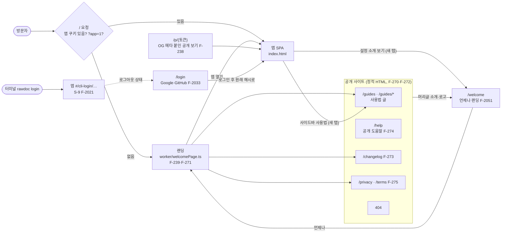
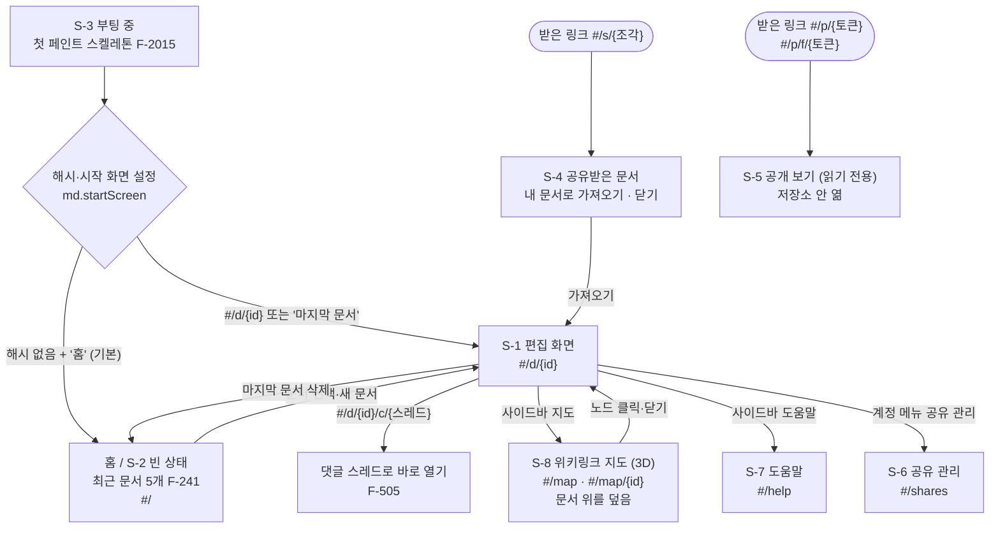
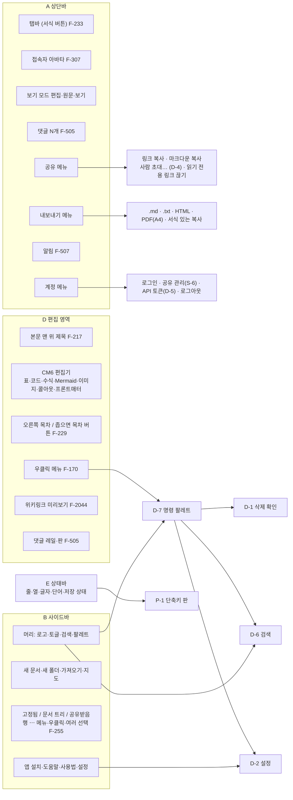
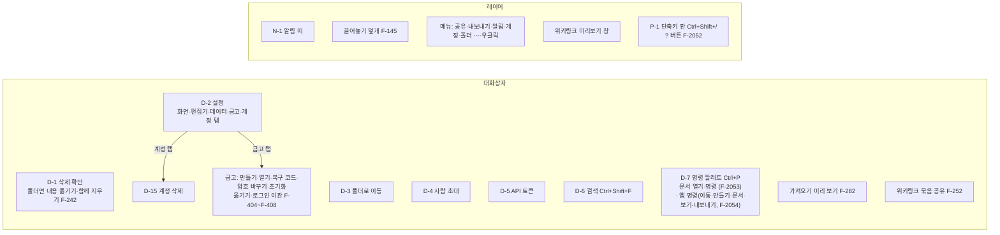
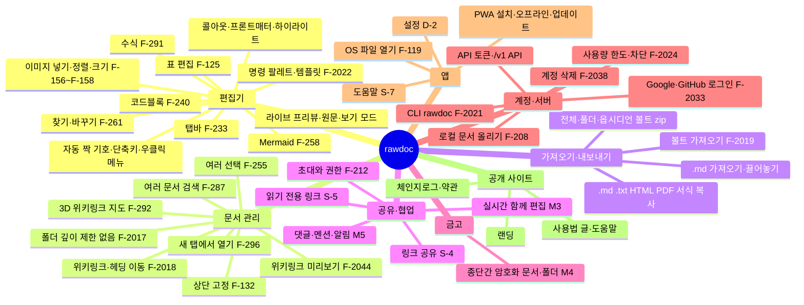

# Rawdoc 화면·기능 지도

작성일: 2026-09-27
목적: 와이어프레임 없이 기능부터 쌓았으므로, 지금 있는 페이지·화면·레이어·기능을 한 장에서 본다. 모바일 검수(7장)의 체크리스트 뼈대로 쓴다
근거: `specs/ia.md` 1~3장, `specs/product.md`, `npm run specs` 목록(2026-09-27), 코드 `src/app/hashRoute.ts`·`worker/index.ts`·`worker/rootRoute.ts`·`src/app/TopBar.tsx`·`src/app/*Menu.tsx`
갱신: 화면·레이어·진입 경로가 새로 생기거나 없어질 때 main 이 고친다. 세부 동작은 여기 적지 않는다 — 원천은 `ia.md` 와 각 `F-xxx.md`

> 머메이드(Mermaid): 글로 적은 도식을 그림으로 그려 주는 문법. GitHub·VS Code 머메이드 확장·rawdoc 보기 모드(F-258)에서 그림으로 보인다

## 1. 주소 단위 — 서버가 무엇을 내려 주나

같은 `/` 가 쿠키에 따라 랜딩 또는 앱을 준다(`worker/rootRoute.ts` `rootTarget`). 앱 안은 해시(`#/…`) 하나로 화면을 가른다

## 2. 앱 안 화면 — 해시가 정하는 것

`src/app/hashRoute.ts` 의 `HashRoute` 종류와 `ia.md` 1장 화면 번호를 맞춘 것. S-9 는 `App` 을 띄우지 않는 별도 진입이다

## 3. 편집 화면(S-1) 영역과 거기서 여는 것

`ia.md` 2장 영역 A~E 와 `TopBar.tsx` 버튼 순서. 좁은 창(1024px 미만)에서는 사이드바 머리 묶음이 상단바 왼쪽으로 오고, 탭바는 상단바 아래 둘째 줄로 내려간다(`TopBar.tsx` `narrow`)

## 4. 대화상자·레이어

모두 앱 안에서 그린다(`alert`·`confirm` 안 씀, `ia.md` 1장). 번호 없는 것은 `ia.md` 1장 표에 아직 없는 것 — 이 문서에서 번호를 새로 매기지 않는다

## 5. 기능 묶음

`product.md` 4·7장과 명세 목록을 묶은 것. 괄호 안은 대표 명세

## 6. 폭 구간 — 화면이 바뀌는 경계

코드·명세에 적힌 경계만 적는다

| 경계 | 바뀌는 것 | 근거 |
| --- | --- | --- |
| 1024px 미만 | 사이드바가 숨고 겹쳐 열림, 레일·너비 손잡이 없음, 탭바가 상단바 둘째 줄로 | `ia.md` 3.11·3.27, `TopBar.tsx` |
| 터치 화면 | 사이드바를 화면 가장자리 밀기로 여닫음, 큰 버튼 | F-227 |
| 오른쪽 여백 56px 미만 | 오른쪽 목차 선 대신 `목차` 버튼 | `ia.md` 3.23, F-229 |
| 600px 이하 | 사이드바 버튼 줄에 검색·팔레트 아이콘, 상단바 검색·팔레트 숨김 | `ia.md` 2장, F-216, F-2053 10.1 |
| 560px 미만 | 지도 설정 패널이 폭 100% | `ia.md` 7장 |
| 1055px 이하 (공개 사이트 글 페이지) | 문서 목록·목차가 제목 아래 접는 `목차` 하나로 | `ia.md` 1장, F-2036 |

## 7. 모바일 검수 목록 (다음 작업)

상태: 전부 **미검수**. 검수하면서 `결과` 칸을 채운다. 아래 "위험" 은 명세 문장에서 읽은 것이고, 실제로 문제인지는 아직 확인 안 함

| # | 대상 | 명세에서 읽은 위험 | 결과 |
| --- | --- | --- | --- |
| M1 | 랜딩 `/` | 폭별 배치, 앱 열기 동선 | |
| M2 | 공개 사이트 글 페이지 | 1055px 이하 접는 목차 | |
| M3 | `/login` | 좁은 폭 버튼 배치 | |
| M4 | 부팅·홈(S-2·S-3) | 최근 문서 목록 터치 크기 | |
| M5 | 사이드바 겹쳐 열기 | 가장자리 밀기(F-227)와 브라우저 뒤로 가기 제스처 충돌 여부 | |
| M6 | 사이드바 행 `⋯` 메뉴 | "마우스 오버 또는 키보드 포커스 시 표시" — 터치에서 어떻게 드러나는지 명세에 없음 | |
| M7 | 사이드바 우클릭·여러 선택 | 터치 대체 동작이 명세에 없음 | |
| M8 | 상단바 버튼 | 아이콘만 + 툴팁 — 터치에는 호버가 없어 이름이 안 보임. 600px 이하 넘침(F-216 이후 버튼 늘어남: 댓글·알림) | |
| M9 | 탭바 둘째 줄 | 가상 키보드가 뜬 상태에서 위치 | |
| M10 | 편집기 입력 | 한글 IME·가상 키보드·자동 짝 기호 | |
| M11 | 편집기 우클릭 메뉴 | 길게 누르기와 브라우저 기본 선택 메뉴 충돌 | |
| M12 | 표 편집 | 칸 끌어 범위 선택, 가장자리 `+` 버튼 크기 | |
| M13 | 이미지 크기 조절 | 호버로 나오는 정렬 버튼·손잡이 | |
| M14 | 위키링크 미리보기 | 터치에서 판정 안 함(3.32) — 대체 수단 없음이 괜찮은지 | |
| M15 | 목차 버튼 | F-229 | |
| M16 | 검색 D-6 | 가상 키보드와 결과 목록 높이 | |
| M17 | 명령 팔레트 D-7 | ~~진입이 `Ctrl+P`·우클릭뿐 — 휴대폰에서 여는 길~~ F-2053 사이드바·상단바·휴대폰 폭 버튼으로 해소. 남는 것은 구역 머리글·핀 버튼의 터치 크기 | |
| M18 | 설정 D-2 | 왼쪽 탭 5개가 좁은 폭에서 | |
| M19 | 기타 대화상자 | D-1·D-3·D-4·D-5·D-15·금고·가져오기 미리 보기 | |
| M20 | 지도 S-8 | 한 손가락 회전·두 손가락 확대, 길게 누르기 메뉴, 패널 100% | |
| M21 | 댓글 레일·판 | 좁은 폭에서 레일 자리 | |
| M22 | 알림·계정 메뉴 | 메뉴 위치와 화면 밖 넘침 | |
| M23 | 공유받은 문서 S-4 · 공개 보기 S-5 | 받는 사람이 휴대폰으로 여는 경우가 많을 것 | |
| M24 | 공유 관리 S-6 · 도움말 S-7 | 표·목록 폭 | |
| M25 | PWA 설치·오프라인 | 안드로이드 크롬 설치 흐름 | |
| M26 | 내보내기 | 휴대폰 다운로드·PDF 인쇄 | |
| M27 | 가져오기 | 파일 선택 창, 끌어놓기는 휴대폰에 없음 | |
| M28 | 단축키 판 `?` 버튼 | 터치 전용 기기에서 `?` 버튼 숨김 (F-2052) | |
